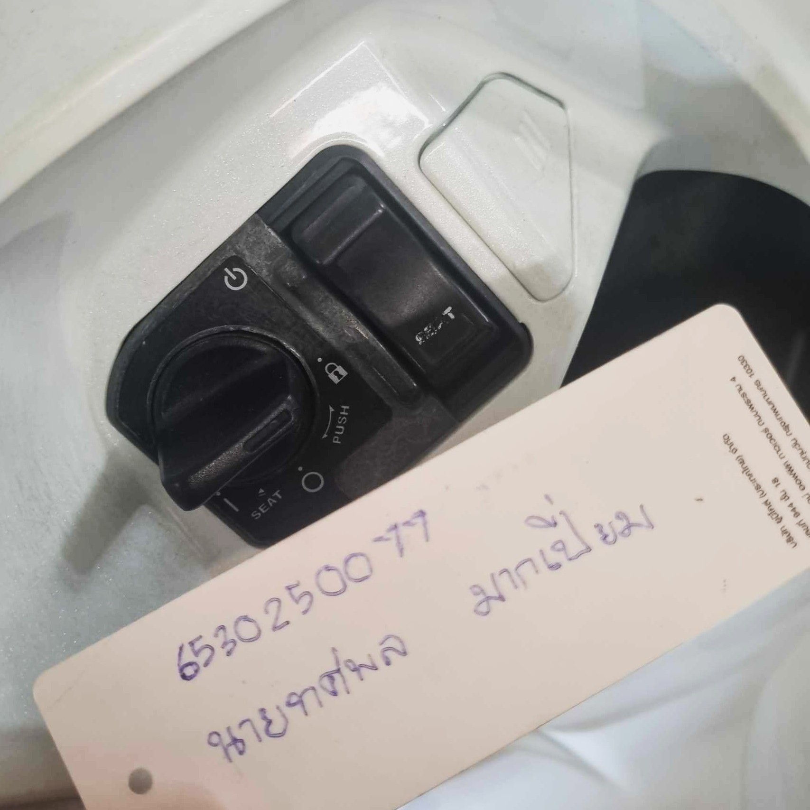

# Security Control
## ลูกบิดกุญแจมอเตอร์ไซค์ในฐานะมาตรการควบคุมความปลอดภัย
- Control Function: Preventative , Detective Controls
- Type of Security Control : Physical Control
  #

## ประเภทของมาตรการควบคุมความปลอดภัย
### มาตรการควบคุมทางกายภาพ (Physical Controls)
#### 1 . มาตรการป้องกัน (Preventative Controls)
- ลูกบิดกุญแจมอเตอร์ไซค์ (ป้องกันการสตาร์ทโดยไม่ได้รับอนุญาต)

#### 2 . มาตรการตรวจจับ (Detective Controls)
- หากลูกบิดกุญแจมีเซ็นเซอร์ตรวจจับการงัดแงะ (Tamper Detection) หรือมีเสียงเตือนเมื่อมีการพยายามไขกุญแจผิดปกติ ก็สามารถจัดอยู่ในกลุ่ม Detective Controls ได้

# สรุป
ลูกบิดกุญแจมอเตอร์ไซค์เป็นรูปแบบของ **มาตรการควบคุมความปลอดภัยทางกายภาพ (Physical Security Control)** ซึ่งอยู่ภายใต้ **มาตรการป้องกัน (Preventative Controls)** เนื่องจากช่วยป้องกันการเข้าถึงและใช้งานยานพาหนะโดยไม่ได้รับอนุญาต และ **มาตรการตรวจจับ (Detective Controls) เนื่องจากลูกบิดกุญแจมีเซ็นเซอร์ตรวจจับการงัดแงะหรือมีเสียงเตือนเมื่อมีการพยายามไขกุญแจผิดปกติ**

